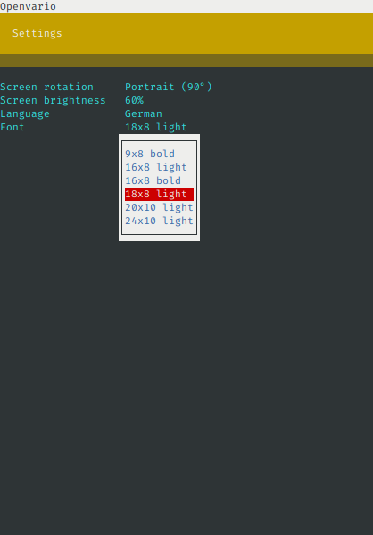

# Main Menu Shell for Openvario

[](https://travis-ci.com/kedder/openvario-shell)
[](https://coveralls.io/github/kedder/openvario-shell)
[](http://mypy-lang.org/)
[](https://github.com/psf/black)
[](https://codeclimate.com/github/kedder/openvario-shell/maintainability)

This is a replacement for stock main menu shipped with official
[Openvario](https://openvario.org/) images. It is implemented in Python and
offers more extensibility and richer user interface than stock shell
script-based one.

The goal of this project is to provide a user interface for managing Openvario
device that is:

* **User friendly** -- responsive, can be operated with remote stick or
  minimal input controls.
* **Feature rich**  -- allow to manage all aspects of device, including
  connected devices, files, etc.
* **Extensible** -- allow to integrate third-party applications.
* **Simple to develop and test** -- written in Python, can be tested without
  Openvario device at hand.

 

## Installation

The easiest way to install is using `opkg` package manager on
internet-connected Openvario device.

```sh
$ echo src/gz kedder_core http://openvario.lebedev.lt/opkg/armv7vet2hf-neon/ >> /etc/opkg/customfeeds.conf
$ echo src/gz kedder_all http://openvario.lebedev.lt/opkg/all/ >> /etc/opkg/customfeeds.conf
$ opkg update
$ opkg install openvario-shell openvario-shell-autostart --force-removal-of-dependent-packages
```

After executing these commands, `ovshell` command should be available. It will
start automatically next time Openvario boots up.

In case you didn't like it and would like to return to stock Openvario menu,
run this command:

```sh
$ opkg install ovmenu-ng ovmenu-ng-autostart --force-removal-of-dependent-packages
```

## Development

It is not required to own or have access to Openvario device in order to
develop `ovshell`. The only requirements are Python 3.7 or higher and terminal
emulator, readily available on MacOS or Linux operating systems. There are lots
of free options for Windows as well.

### Setting up the development environment

`ovshell` uses `pipenv` for managing dependencies and dev environment. If you
don't have it yet, install with:

```sh
$ pip install pipenv
```

After checking out the sources, `cd` to `openvario-shell` directory and run:

```sh
$ pipenv shell
$ pipenv install
```

After that, your development environment is ready, you should be able to run
the app:

```sh
$ ovshell
```

It is possible to adjust few options by providing them in `.env` file, located
in project directory. You can copy the sample file `sample.env` to `.env` and
adjust values there.

### Development tools

`ovshell` uses various tools to check the code quality. They are generally
available through `make` program. Most useful are these:

* `make test` - runs the test suite
* `make coverage` - runs the test suite and display test coverage statistics
* `make mypy` - checks the sources with static type checker
* `make black` - reformats the source code to match the code style
